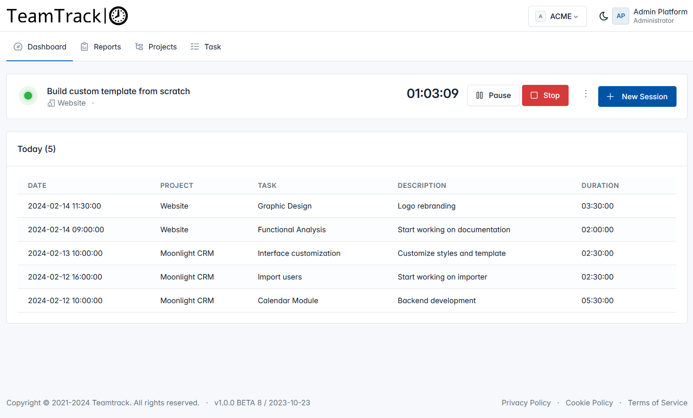

<p align="center"></a></p>


# TeamTrack

Teamtrack is a time tracking software for teams based on Laravel 10.x


# About TeamTrack

TeamTrack is a web-based and self-hosted time-tracking application, free and open-source. It handles use-cases of freelancers as well as companies with dozens or hundreds of users. 



## ✨ Features

Main features:

-   Multiple Workspaces
-   Projects / Tasks Management
-   Work Session Management

# Installation

```
composer install
cp .env.example .env
php artisan key:generate
php artisan migrate
php artisan db:seed
npm install
npm run build
```

## Refresh database

```
php artisan migrate:fresh --seed
```


# Create User

```
php artisan tinker
```

```
$user = new App\Models\User();
$user->firstname = 'My FirstName';
$user->lastname = 'My LastName';
$user->email = 'the-email@example.com';
$user->password = Hash::make('changeme');
$user->save();
```


# Update User Password

```
php artisan tinker
```

```
$user = App\Models\User::where('email', 'youremail@gmail.com')->first();
$user->password = Hash::make('yournewpassword');
$user->save();
```

## Translations and Auto translations

Generate JSON language file:

```
php artisan translations:export it,es
```

Translate String via Google Translator 

```
php artisan translations:translate it,es
```

To override a translation, create a file in `resources/lang/persistent-strings-it.json`

